# MarketMingle

MarketMingle is a web application aimed at providing a platform for users to discuss and share insights about the stock market. Whether you're a seasoned investor or just getting started, MarketMingle offers a space to engage with fellow traders, share opinions, and stay informed about market trends.

The live link to the site can be found here - [MarketMingle](https://marketmingle-d94891f1357b.herokuapp.com/)

## Site Owner Goals

- To create a vibrant community where users can freely discuss and exchange insights about the stock market.
- To provide users with easy access to relevant information and resources to enhance their trading experience.
- To foster engagement through features such as polls, following other users, and expressing bullish or bearish sentiments on posts.
- User-friendly design to ensure a seamless and enjoyable experience for all users.

## User Stories

- ### First-time User
  - As a first-time user, I want to understand the purpose of the site and how it can benefit me in navigating the stock market.
  - As a first-time user, I want to easily navigate the website and find relevant discussions without needing to sign up immediately.
  - As a first-time user, I want to explore the features of the site, such as polls and sentiment indicators, to gauge community sentiment.

- ### Returning User
  - As a returning user, I want to quickly access the latest discussions and updates on the stock market to stay informed.
  - As a returning user, I want to engage with other users by commenting on posts and following users with valuable insights.
  - As a returning user, I want to express my sentiment on posts by indicating whether I am bullish or bearish, contributing to the overall discussion.

- ### Frequent User
  - As a frequent user, I want to personalize my profile by adding a profile picture and a bio, enhancing my presence within the community.
  - As a frequent user, I want to participate in polls to share my opinion on various market topics and see how others are voting.
  - As a frequent user, I want to receive notifications about new posts, comments, and updates from users I follow, ensuring I stay engaged and informed.

## Features

All features have been prioritized and developed in response to the needs outlined in the user stories during the planning stage.

### Existing Features

#### Authentication

- Secure registraion and login process to ensure user authenticity.
- Once registered and logged in, users can set a new username and password in their profile.
- Logged out users have limited access to the features:
    - They won't see bull bear in the nav. they also won't see the poll.
    - They will be redirected back to the home page if they try access pages restricted to logged in users, like create a post.

Logged out user

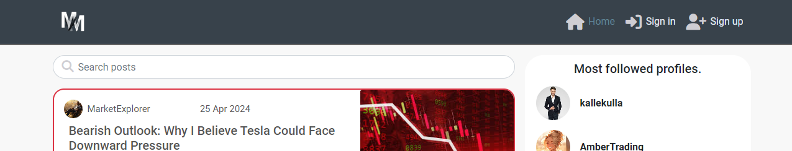

Logged in user

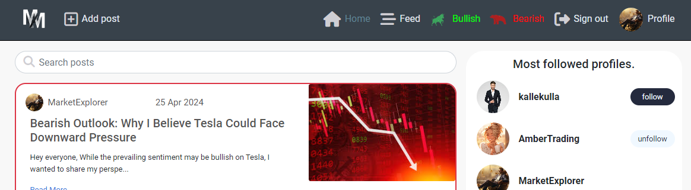

Account settings

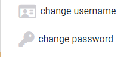

Change username

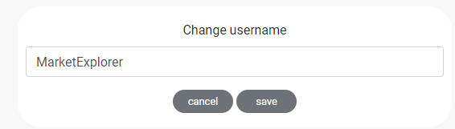

Change password

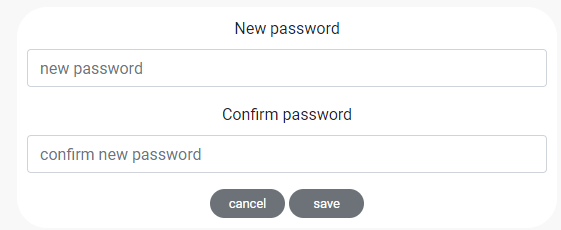

#### Navigation

- Responsive top navigation bar adaptable to various screen sizes.
- For logged-in users, additional options are accessible, including direct links to their profiles, ability to create posts, see the posts that they bullish or bearish, and logout option.
- On mobile size they can see a hambuger logo in the left corner.

Navigation

Navigation mobile

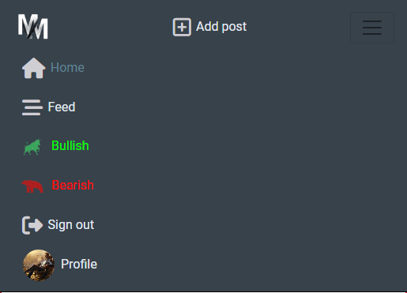

#### Profiles

- Personalized profiles showcasing user bio and posts.
- Displays follower counts and provides follow/unfollow functionality directly from the profile view if the visiting user is logged in.
- Features an edit option for users to update their profile bio and avatar.

Own profile

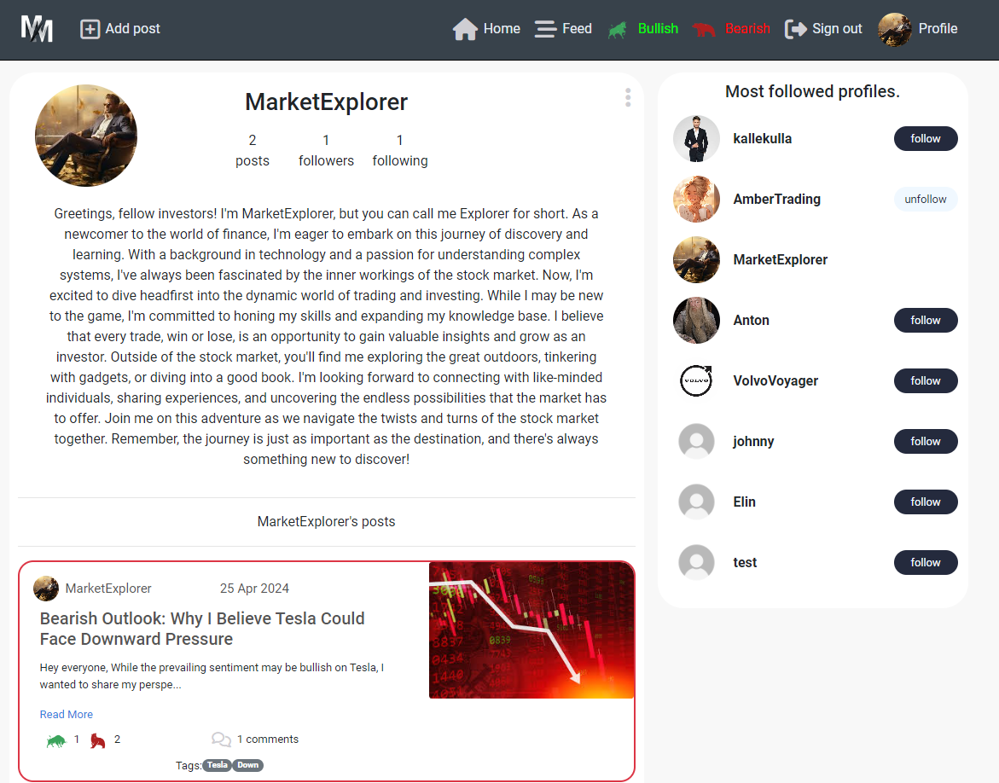

Profile - logged in

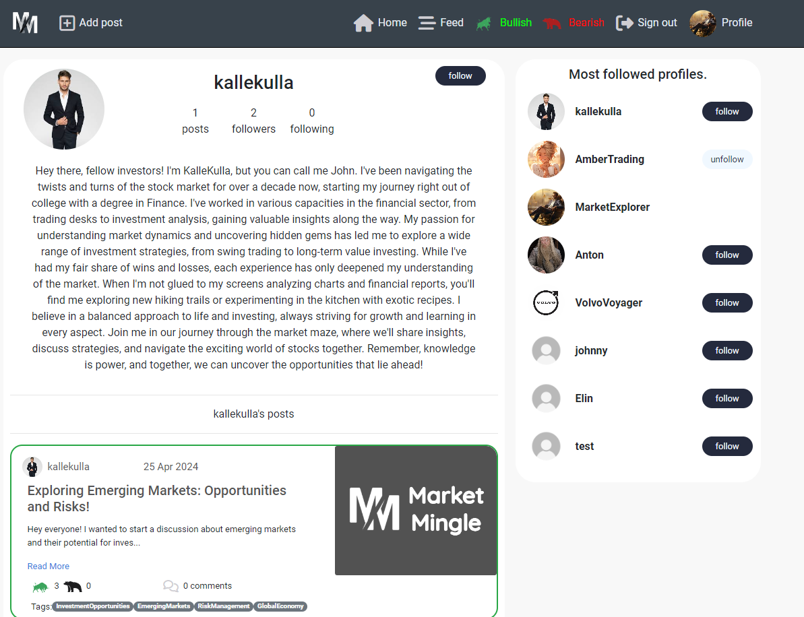

Profile - logged out

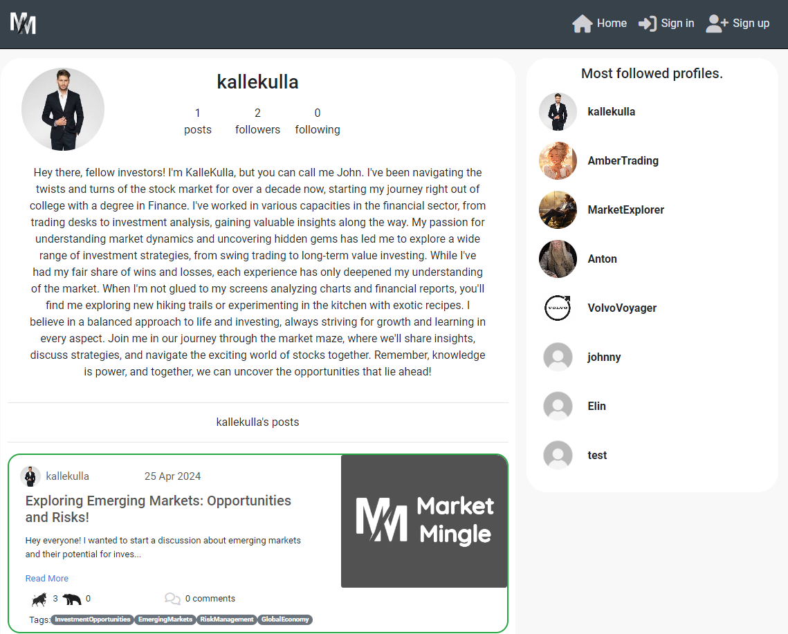

#### Home Page / Posts

- The home page dynamically adjusts based on user authentication status.
- When logged out displays all posts.
- When logged in you can see the polls and follow users.

Posts - logged out

Posts - logged in

#### Add / Edit / Delete Post

- Users can add new posts, specifying details such as an image, title and content.
- Users can add tags to their posts.
- Editing functionality enables users to update their posts, ensuring the information remains relevant and accurate.
- Users can delete their own posts.

Add post

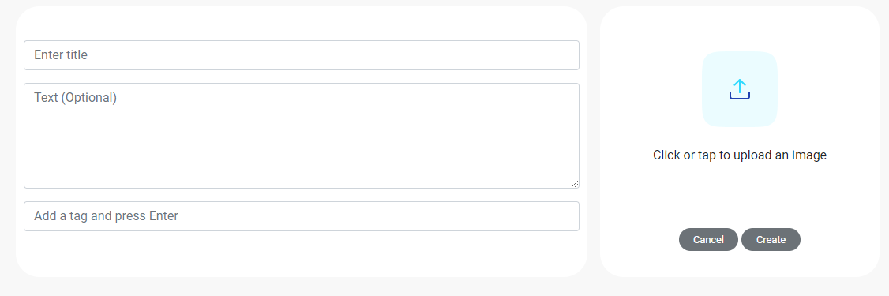

Edit post

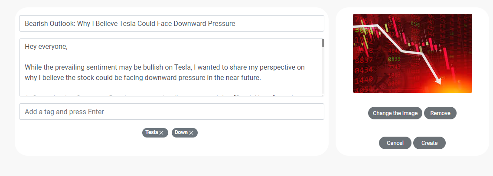

Delete post

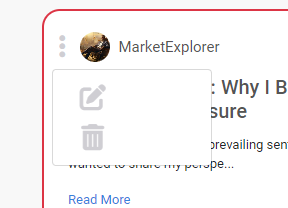

#### Follow / Unfollow Profiles

- Users can follow or unfollow others directly from their profiles, facilitating community building and interaction.
- The following system updates content feeds to include posts from followed users.
- Following / unfollowing users in the Feed Page updates instantly the page to include / exclude the posts.

Follow - popular profiles

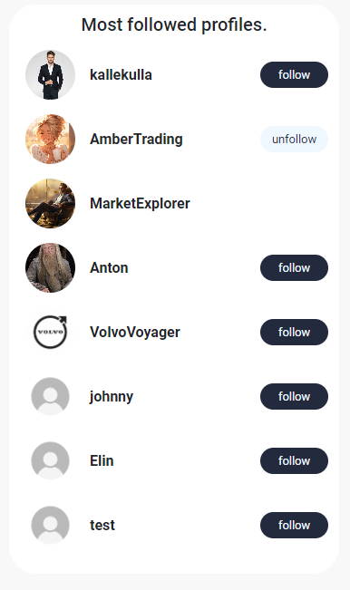

Follow - Profile page

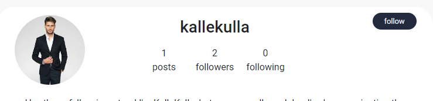

#### Comment and Edit / Delete Comments (Posts and Events)

- Commenting feature available on posts for users to engage in discussions.
- Provides options to edit or delete their comments, ensuring flexibility in communication.

Comment field

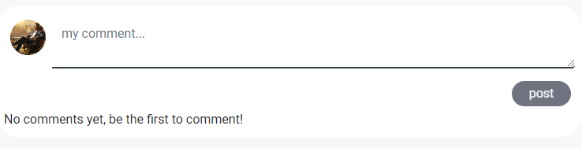

Comment

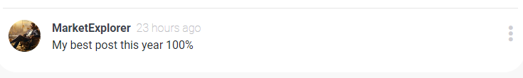

Edit Comment

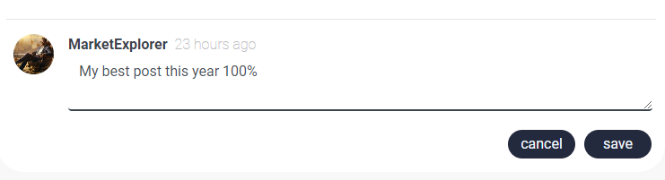

Delete Comment

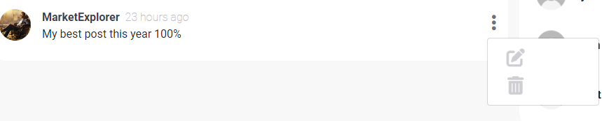

#### Search

- Comprehensive search functionality that applies to posts.

Search - post

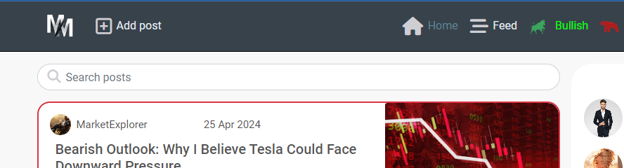

#### bullish / bearish

- bullish / bearish functionality for posts to express appreciation or interest.
- Users can be bullish / bearish posts, if the post is bullish the post will glow in green and if the post is bearish the post will glow in red. with updates reflected in real-time.

Bullish post

Bearish post

#### Poll
- Logged-in users can participate in the poll.
- You can only answer the poll once, and if you choose one answer, the other options will turn grey.

Poll

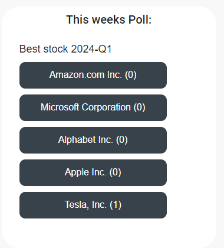

Poll pressed

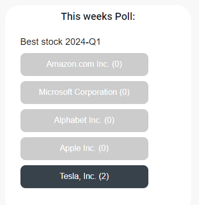

