# MarketMingle

MarketMingle is a web application aimed at providing a platform for users to discuss and share insights about the stock market. Whether you're a seasoned investor or just getting started, MarketMingle offers a space to engage with fellow traders, share opinions, and stay informed about market trends.

The live link to the site can be found here - [MarketMingle](https://marketmingle-d94891f1357b.herokuapp.com/)

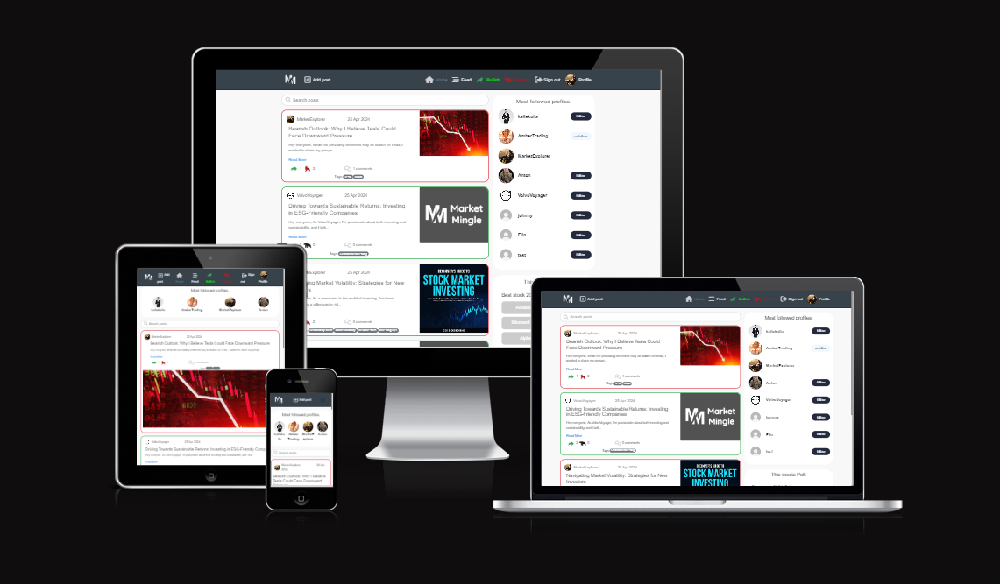


- [MarketMingle](#marketmingle)
  * [Site Owner Goals](#site-owner-goals)
  * [User Stories for "marketmingle"](#user-stories-for--marketmingle-)
  * [Features](#features)
    + [Existing Features](#existing-features)
      - [Authentication](#authentication)
      - [Navigation](#navigation)
      - [Profiles](#profiles)
      - [Home Page / Posts](#home-page---posts)
      - [Add / Edit / Delete Post](#add---edit---delete-post)
      - [Follow / Unfollow Profiles](#follow---unfollow-profiles)
      - [Comment and Edit / Delete Comments (Posts and Events)](#comment-and-edit---delete-comments--posts-and-events-)
      - [Search](#search)
      - [bullish / bearish](#bullish---bearish)
      - [Poll](#poll)
      - [Tags](#tags)
    + [Future Features](#future-features)
      - [Short term goals](#short-term-goals)
      - [Long term goals](#long-term-goals)
    + [Wireframes](#wireframes)
    + [Colors](#colors)
    + [Fonts](#fonts)
  * [Technologies Used](#technologies-used)
    + [JavaScript and React Libraries](#javascript-and-react-libraries)
    + [Other Technologies](#other-technologies)
  * [Testing](#testing)
  * [Deployment and Development](#deployment-and-development)
  * [Credits](#credits)
  * [Acknowledgments](#acknowledgments)

<small><i><a href='http://ecotrust-canada.github.io/markdown-toc/'>Table of contents generated with markdown-toc</a></i></small>


## Site Owner Goals

- To create a vibrant community where users can freely discuss and exchange insights about the stock market.
- To provide users with easy access to relevant information and resources to enhance their trading experience.
- To foster engagement through features such as polls, following other users, and expressing bullish or bearish sentiments on posts.
- User-friendly design to ensure a seamless and enjoyable experience for all users.


## User Stories for "marketmingle"
<details><summary>Polls</summary>

### As a logged-in user
I can participate in polls created by the admin to share my opinion on various topics or questions.

**Acceptance criteria:**
- Polls should be visible and accessible to logged-in users on the platform.
- Each poll should include options for users to select their preferred choice or answer.
- After submitting my vote, the poll should update to reflect the overall voting results.
- Users should only be allowed to vote once in each poll to maintain voting integrity and accuracy.
- The poll results should be visible to all users after voting, providing transparency and engagement.
</details>
<details><summary> Tags</summary>

### As a logged-in user
I want to be able to assign tags or categories to my notes

So that I can easily categorize and retrieve related notes based on topics or themes.

**Acceptance criteria:**
-  When creating or editing a note, there should be an option to add tags from a predefined list or enter them manually.
- Tags should be visible on the note details page and clickable to filter notes by the selected tag.
- Each note can have multiple tags assigned to it for comprehensive organization.
</details>
<details><summary>Bullish/Bearish</summary>

### As a logged-in user
I want to be able to like posts on "marketmingle" to show my appreciation for content that interests me.

**Acceptance criteria:**
-  Logged-in users can like posts by clicking on a dedicated "bullish/bearish" button associated with each post.
- Upon clicking the "bullish/bearish" button, the post's bullish/bearish count increases, indicating user appreciation.
- Users can only like a post once.
- The post will turn green if bullish and red if bearish.
</details>
<details><summary>Viewing Profiles</summary>

### As a user
I want to view other users' profiles on "marketmingle" to see their posts and learn more about them.

**Acceptance criteria:**
- Users can navigate to other users' profiles on "marketmingle" from their posts or through a dedicated search feature.
- The profile page displays essential information about the user, including their bio, profile picture, number of posts, followers, and users they follow.
- Users can scroll through the user's posts and engage with them if desired.
</details>
<details><summary>Viewing Avatars</summary>


### As a user
I want to view other users' avatars to easily identify them within the "marketmingle" community.

**Acceptance criteria:**
- Avatars of other users are prominently displayed alongside their usernames and posts within the "marketmingle" forum.
- Avatars provide visual cues that aid users in identifying and distinguishing between different forum members.
- Avatars are displayed consistently and accurately across various sections of the forum, ensuring a cohesive user experience.
</details>
<details><summary>Viewing Followed Users' Content</summary>

### As a logged-in user
I want to view content from users I follow on "marketmingle" to keep up with their contributions to the forum.

**Acceptance criteria:**
- Logged-in users can access a section or page on "marketmingle" to view posts from users they follow.
- Posts from followed users are displayed in chronological order, allowing users to stay updated on their contributions.
- Users can seamlessly navigate through multiple pages of followed users' posts using intuitive controls.
</details>
<details><summary>Following and Unfollowing Users</summary>

### As a logged-in user
I want to follow and unfollow other users on "marketmingle" to customize my posts feed and interactions.

**Acceptance criteria:**
- Logged-in users have the option to follow or unfollow other users on "marketmingle" from their profile pages or posts.
- A follow button is displayed on the profile page, allowing users to initiate or terminate the follow relationship.
- Upon following or unfollowing a user, the follower count and following count are updated accordingly.
</details>
<details><summary>Maintaining Logged-in Status</summary>

### As a user
I want my logged-in status to be maintained until I choose to log out, ensuring uninterrupted user experience.

**Acceptance criteria:**
- User sessions are maintained consistently across multiple browsing sessions until the user actively logs out.
- Users remain logged in even after prolonged periods of inactivity, ensuring uninterrupted access to forum features.
- Access tokens are periodically refreshed to prevent unauthorized access and ensure security.
</details>

<details><summary>Deleting Comments</summary>

### As the owner of a comment
I want to delete my comments on "marketmingle" to have control over the content I contribute.

**Acceptance criteria:**
- Comment owners have the option to delete their comments on "marketmingle" to exercise control over the content they contribute.
- A delete option is available next to each comment, allowing comment owners to remove their comments from the post page.
- Upon confirmation, the deleted comment is permanently removed from the post page.
</details>
<details><summary>Viewing User Statistics</summary>

### As a user
I want to view statistics about specific users on "marketmingle" to learn more about them.

**Acceptance criteria:**
- Users can access detailed statistics about specific users on "marketmingle" from their profile pages.
- The user stats section includes information such as the user's bio, total number of posts, followers count, and users they follow.
- The information is presented in a clear and organized manner, allowing users to learn more about the profile owner.
</details>
<details><summary>Updating Username and Password</summary>

### As a logged-in user
I want to update my username and password on "marketmingle" to change my display name and ensure account security.

**Acceptance criteria:**
- Logged-in users have the option to update their usernames and passwords on "marketmingle" for security and personalization purposes.
- An option to update username and password is accessible from the user settings or profile page.
- Users can enter new usernames and passwords and confirm the changes, ensuring account security and customization.
</details>
<details><summary>Editing Profile</summary>

### As a logged-in user
I want to edit my profile on "marketmingle" to change my profile picture and bio.

**Acceptance criteria:**
- Logged-in users can edit their profiles on "marketmingle" to update their profile picture and bio.
- An edit option is available on the profile page, allowing users to modify their profile information.
- Upon submission of changes, the profile is updated with the new profile picture and bio.
</details>
<details><summary>Viewing Most Followed Profiles</summary>

### As a user
I want to see a list of the most followed profiles on "marketmingle" to discover popular users within the community.

**Acceptance criteria:**
- A list of the most followed profiles is accessible to users on "marketmingle" through a designated section or page.
- The list displays the usernames or profile pictures of the most followed users, sorted by the number of followers.
- Users can click on a profile to view more details or choose to follow the user directly from the list.
</details>
<details><summary>Viewing All Posts by a Specific User</summary>

### As a user
I want to view all posts by a specific user on "marketmingle" to catch up on their latest contributions or decide whether to follow them.

**Acceptance criteria:**
- Users can access a list of all posts made by a specific user on "marketmingle" from their profile page.
- The list displays the titles or thumbnails of the user's posts, sorted by the most recent.
- Users can click on a post to view its details or engage with it directly from the list.
</details>
<details><summary>Adding Comments to Posts</summary>

### As a logged-in user
I want to add comments to posts on "marketmingle" to share my thoughts and opinions.

**Acceptance criteria:**
- Post owners have access to an edit option on "marketmingle" to modify the title and description of their posts.
- The edit interface allows post owners to make corrections or updates to the post content.
- Upon submission of the edits, the post is updated with the revised title and description.
</details>
<details><summary>Editing Post Title and Description</summary>

### As the owner of a post
I want to edit the title and description of my post on "marketmingle" to make corrections or updates.

**Acceptance criteria:**
- Post owners have access to an edit option on "marketmingle" to modify the title and description of their posts.
- The edit interface allows post owners to make corrections or updates to the post content.
- Upon submission of the edits, the post is updated with the revised title and description.
</details>
<details><summary>Seamless Scrolling</summary>

### As a user
I want to scroll through posts seamlessly with infinite scrolling, ensuring a smooth browsing experience without the need to click on "next page."

**Acceptance criteria:**
- Users can scroll through posts seamlessly on "marketmingle" using infinite scrolling functionality.
- As the user scrolls down the page, additional posts are dynamically loaded and appended to the existing content.
- Infinite scrolling ensures a smooth browsing experience without interruptions or the need to click on a "next page" button.
</details>
<details><summary>Searching for Posts</summary>

### As a user
I want to search for posts using keywords on "marketmingle" so that I can find specific content and user profiles that interest me.

**Acceptance criteria:**
- Users have access to a search bar or functionality on "marketmingle" to search for posts using keywords.
- The search results display relevant posts matching the entered keywords, along with their titles, authors, and timestamps.
- Users can click on search results to navigate directly to the respective posts for detailed viewing.
</details>
<details><summary>Viewing Most Recent Posts</summary>

### As a user
I want to view the most recent posts on "marketmingle," ordered by the latest creations, to stay up-to-date with the latest discussions and content.

**Acceptance criteria:**
- Users can access a dedicated section or page on "marketmingle" to view the most recent posts.
- The posts are displayed in descending order based on their creation timestamp, ensuring the latest discussions are prioritized.
- Users can navigate through multiple pages of recent posts if the number of posts exceeds the display limit on a single page.
</details>
<details><summary>Viewing Liked Posts</summary>

### As a logged-in user
I want to view posts that I have liked on "marketmingle" to revisit content that I enjoyed.

**Acceptance criteria:**
- Logged-in users have a designated section or page on "marketmingle" to view posts they have liked.
- Liked posts are presented in a user-friendly format, showcasing relevant information such as title, author, and timestamp.
- Users can click on liked posts to navigate directly to the respective posts for detailed viewing or engagement.
</details>
<details><summary>Viewing Post Details</summary>

### As a user
I want to view the details of a single post on "marketmingle" to learn more about the content shared.

**Acceptance criteria:**
- Users can click on a post title or thumbnail to view the details of a single post.
- The post page displays the post title, content, author, creation date, and any associated tags.
- Users can scroll through comments and interact with the post's content.
</details>
<details><summary>Editing Comments</summary>

### As the owner of a comment
I want to edit my comments on "marketmingle" to make corrections or updates.

**Acceptance criteria:**
- Comment owners can edit their comments on "marketmingle" to make corrections or updates.
- An edit option is provided next to each comment, enabling comment owners to modify the comment text.
- Upon submission of the edits, the comment is updated with the revised text.
</details>
<details><summary>Creating Posts</summary>

### As a logged-in user
I want to create posts on "marketmingle" to share stock tips and other stock-related content with the community.

**Acceptance criteria:**
- Logged-in users can access a post creation interface on "marketmingle."
- The post creation interface includes fields for title, content, and optional tags.
- Upon successful submission, the post is published to the forum and made visible to other users.
</details>
<details><summary>Seamless Page Navigation</summary>

### As a user
I want to navigate through pages swiftly without page refreshes, ensuring seamless content viewing.

**Acceptance criteria:**
- Page transitions occur swiftly and seamlessly without the need for page refreshes.
- Users can navigate between pages using intuitive controls, such as clickable links or buttons.
- Content loads quickly and smoothly, enhancing the overall user experience.
</details>
<details><summary>Viewing Navigation Bar</summary>

### As a user
I want to see a navigation bar on every page so that I can easily navigate between different sections of the forum.

**Acceptance criteria:**
- The navigation bar is displayed consistently across all pages of the forum.
- The navigation bar provides links to different sections of the forum, allowing users to easily switch between them.
- The navigation bar remains accessible and functional regardless of the user's location within the forum.
</details>
<details><summary>Reading Comments</summary>

### As a user
I want to read comments on posts on "marketmingle" to see other users' perspectives on the content.

**Acceptance criteria:**
- Users can read comments on posts on "marketmingle" to gain insights into other users' perspectives on the content.
- Comments are displayed in a user-friendly format, including the commenter's username, timestamp, and comment text.
- Users can scroll through multiple comments and engage with them if desired.
</details>
<details><summary>Creating a New Account</summary>

### As a user
I want to create a new account on "marketmingle" so that I can access all the features available to registered users.

**Acceptance criteria:**
- Users can access a sign-up form to create a new account on "marketmingle."
- The sign-up form includes fields for necessary user information, such as username and password.
- Upon successful submission of the sign-up form, the user receives confirmation of their new account creation.
</details>
<details><summary>Signing In</summary>

### As a user
I want to sign in to "marketmingle" to access the functionalities reserved for logged-in users.

**Acceptance criteria:**
- Users can access a sign-in form to log in to their existing "marketmingle" accounts.
- The sign-in form includes fields for users to enter their credentials, such as email/username and password.
- Upon successful submission of the sign-in form, the user gains access to the functionalities reserved for logged-in users.
</details>
<details><summary>Checking Logged-in Status</summary>

### As a user
I want to be able to determine whether I am logged in or not, ensuring easy access to my account.

**Acceptance criteria:**
- The forum interface provides a clear indication of whether the user is currently logged in or not.
- Logged-in users have access to additional features and functionalities compared to logged-out users.
- Users can easily discern their logged-in status at any point during their browsing session.
</details> 
<details><summary>Accessing Sign-in/Sign-up Options</summary>

### As a logged-out user
I want to see options for signing in or signing up, making it easy for me to access my account.

**Acceptance criteria:**
- When logged out, users are presented with clear options for signing in or signing up prominently on the forum's interface.
- The sign-in and sign-up options are easily accessible and distinguishable from other elements on the page.
- Users are guided seamlessly through the authentication process when attempting to access restricted features while logged out.
</details>
<details><summary>Viewing Post Page</summary>

### As a user
I want to view the post page on "marketmingle" to read comments and engage with the content shared.

**Acceptance criteria:**
- Users can navigate to the post page on "marketmingle" to view the content and comments of a specific post.
- The post page displays the post title, content, author, creation date, and any associated tags.
- Users can scroll through comments and engage with the post's content seamlessly.
</details>
<details><summary>Viewing Comment Timestamps</summary>

### As a user
I want to see the timestamp of comments on "marketmingle" to gauge their recency.

**Acceptance criteria:**
- Users can view the timestamp of comments on "marketmingle" to determine their recency.
- The timestamp is displayed alongside each comment, indicating when it was posted relative to the current time.
</details> 

## Features

All features have been prioritized and developed in response to the needs outlined in the user stories during the planning stage.

### Existing Features

#### Authentication

- Secure registraion and login process to ensure user authenticity.
- Once registered and logged in, users can set a new username and password in their profile.
- Logged out users have limited access to the features:
    - They won't see bull bear in the nav. they also won't see the poll.
    - They will be redirected back to the home page if they try access pages restricted to logged in users, like create a post.

<details><summary>Logged out user</summary>
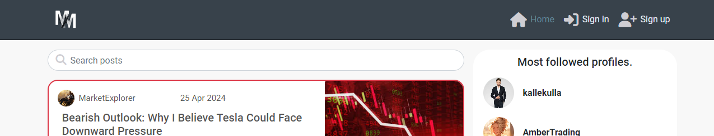
</details>
<details><summary>Logged in user</summary>
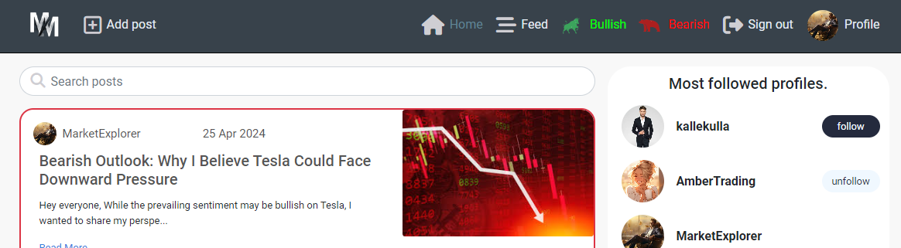
</details>
<details><summary>Account settings</summary>
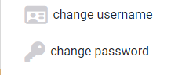
</details>
<details><summary>Change username</summary>
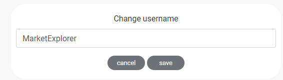
</details>
<details><summary>Change password</summary>
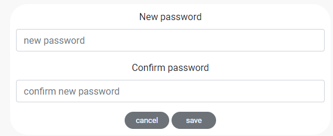
</details>

#### Navigation

- Responsive top navigation bar adaptable to various screen sizes.
- For logged-in users, additional options are accessible, including direct links to their profiles, ability to create posts, see the posts that they bullish or bearish, and logout option.
- On mobile size they can see a hambuger logo in the left corner.

<details><summary>Navigation</summary>

</details>
<details><summary>Navigation mobile</summary>
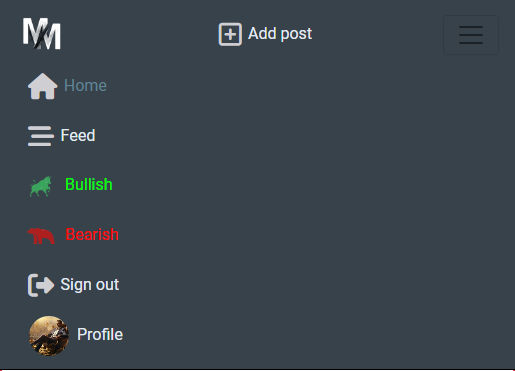
</details>

#### Profiles

- Personalized profiles showcasing user bio and posts.
- Displays follower counts and provides follow/unfollow functionality directly from the profile view if the visiting user is logged in.
- Features an edit option for users to update their profile bio and avatar.

<details><summary>Own profile</summary>
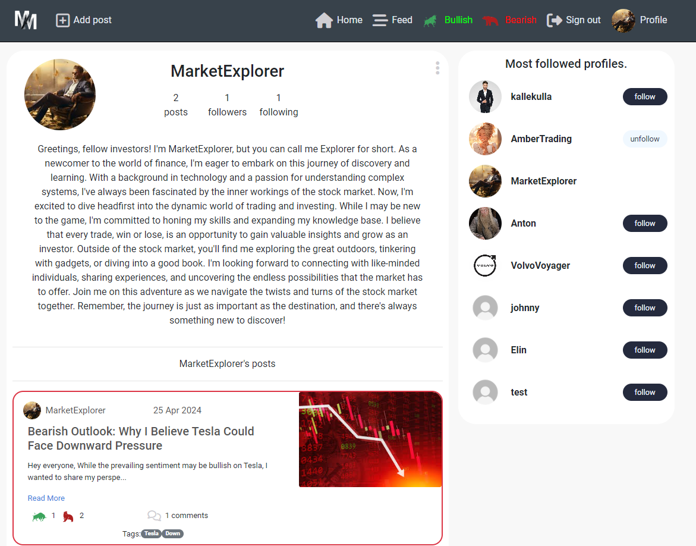
</details>
<details><summary>Profile - logged in</summary>
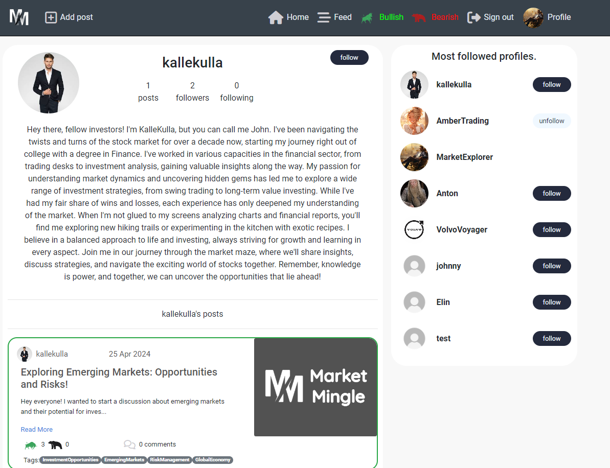
</details>
<details><summary>Profile - logged out</summary>
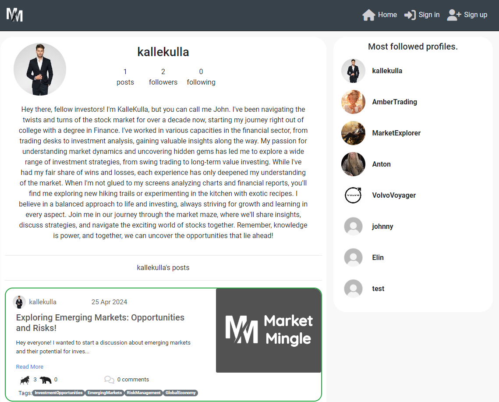
</details>

#### Home Page / Posts

- The home page dynamically adjusts based on user authentication status.
- When logged out displays all posts.
- When logged in you can see the polls and follow users.

<details><summary>Posts - logged out</summary>

</details>
<details><summary>Posts - logged in</summary>

</details>

#### Add / Edit / Delete Post

- Users can add new posts, specifying details such as an image, title and content.
- Users can add tags to their posts.
- Editing functionality enables users to update their posts, ensuring the information remains relevant and accurate.
- Users can delete their own posts.

<details><summary>Add post</summary>
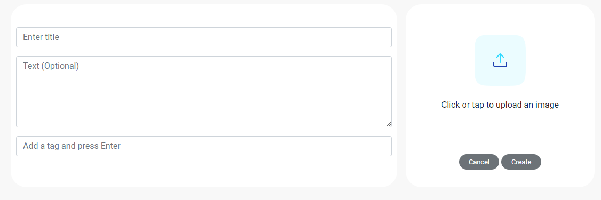
</details>
<details><summary>Edit post</summary>
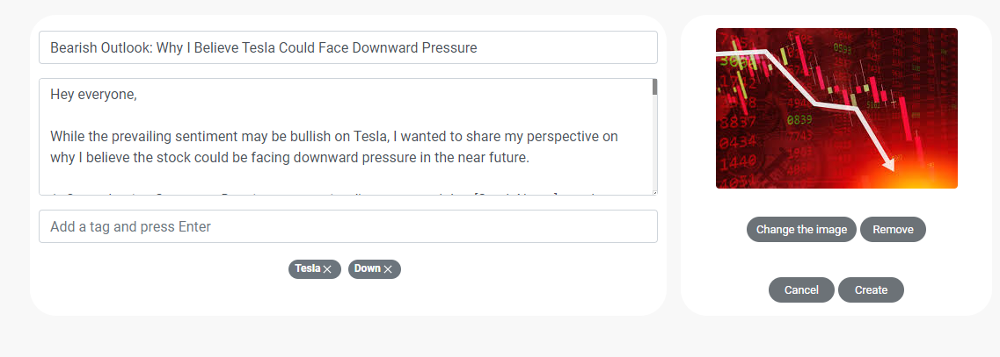
</details>
<details><summary>Delete post</summary>
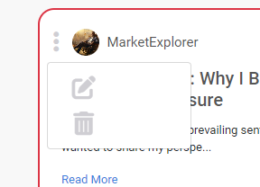
</details>

#### Follow / Unfollow Profiles

- Users can follow or unfollow others directly from their profiles, facilitating community building and interaction.
- The following system updates content feeds to include posts from followed users.
- Following / unfollowing users in the Feed Page updates instantly the page to include / exclude the posts.

<details><summary>Follow - popular profiles</summary>
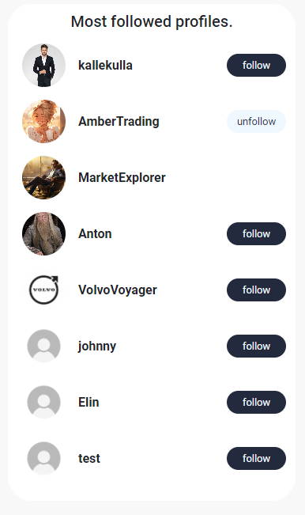
</details>
<details><summary>Follow - Profile page</summary>

</details>

#### Comment and Edit / Delete Comments (Posts and Events)

- Commenting feature available on posts for users to engage in discussions.
- Provides options to edit or delete their comments, ensuring flexibility in communication.

<details><summary>Comment field</summary>
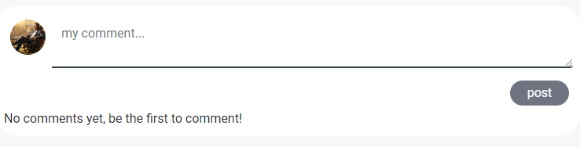
</details>
<details><summary>Comment</summary>
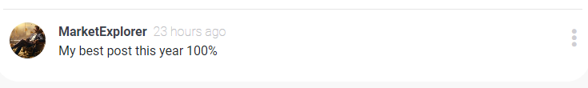
</details>
<details><summary>Edit Comment</summary>
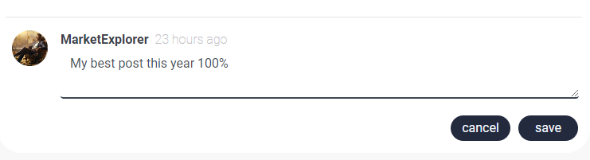
</details>
<details><summary>Delete Comment</summary>
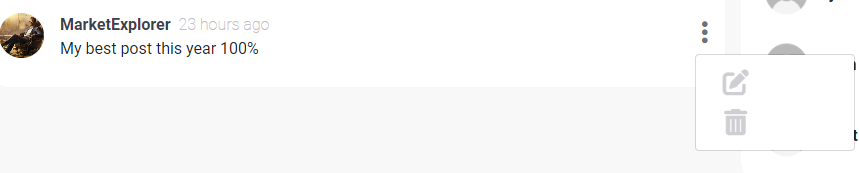
</details>

#### Search

- Comprehensive search functionality that applies to posts.

<details><summary>Search - post</summary>
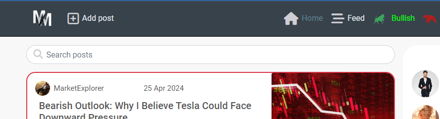
</details>

#### bullish / bearish

- bullish / bearish functionality for posts to express appreciation or interest.
- Users can be bullish / bearish posts, if the post is bullish the post will glow in green and if the post is bearish the post will glow in red. with updates reflected in real-time.

<details><summary>Bullish post</summary>

</details>
<details><summary>Bearish post</summary>

</details>

#### Poll
- Logged-in users can participate in the poll.
- You can only answer the poll once, and if you choose one answer, the other options will turn grey.

<details><summary>Poll</summary>
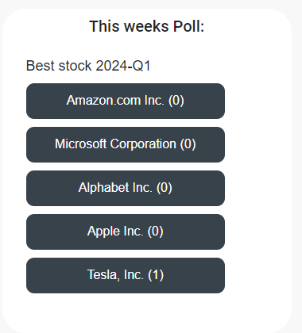
</details>
<details><summary>Poll pressed</summary>
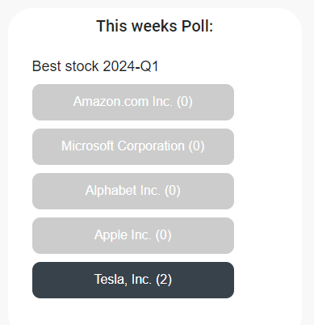
</details>

#### Tags
- Logged-in users can add tags to there posts

<details><summary>tags</summary>
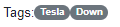
</details>
<details><summary>tags input</summary>
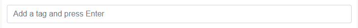
</details>

### Future Features

#### Short term goals

- Real-Time Chat: Implement a real-time chat feature to facilitate instant communication among users.
- Notification System: Introduce a notification system to alert users about new comments, likes, or followers.
- Bookmarking Posts: Allow users to bookmark posts for later reference or reading.
- Dark Mode: Introduce a dark mode option for users who prefer a darker interface.

#### Long term goals

- Virtual Trading: Introduce a virtual trading feature where users can simulate trades and track their performance without risking real money.
- Advanced Analytics: Provide users with advanced analytics and insights into their trading performance based on their activity within the platform.
- Social Trading: Implement social trading functionalities, allowing users to automatically copy trades of successful investors.
- Premium Membership: Introduce a premium membership tier with access to exclusive features, content, and tools.

### Wireframes


The initial wireframes laid the foundation for MarketMingle's layout and functionality. As development progressed, I implemented several enhancements and design adjustments to enhance user experience and interaction. Additionally, I made minor refinements to improve the platform's aesthetics and usability.

<details><summary>Posts wireframe</summary>
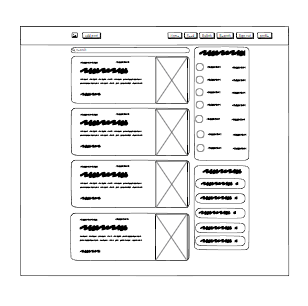
</details>
<details><summary>Login/out wireframe</summary>
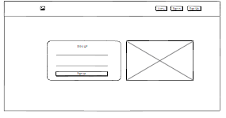
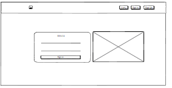
</details>
<details><summary>Profile wireframe</summary>
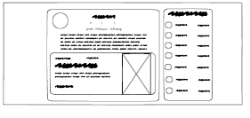
</details>

### Colors

The color scheme for MarketMingle is carefully curated to create a dynamic yet inviting atmosphere:

- Primary Color: Majorelle Blue takes center stage, infusing vibrancy and sophistication into the interface.
- Background: Lavender Blush and Thistle offer a calming backdrop, promoting readability and usability.
- Accent Colors: Raisin Black and Imperial Red are strategically employed to highlight important elements and interactive features, ensuring user engagement and attention.

### Fonts
MarketMingle utilizes the Roboto font family to deliver a modern and clean typographic experience. With its balanced proportions and versatile design, Roboto ensures readability across various devices and screen sizes. Its friendly yet professional appearance contributes to a seamless and engaging user interface, enhancing the overall user experience on the platform.

## Technologies Used

- React: Utilized as the core JavaScript library for building the user interface.
- Create React App: Employed to initialize the React project, providing a standardized setup.

### JavaScript and React Libraries

- Axios: Used to make requests to the backend API.
- Bootsrap and React Bootstrap: For responsive styling and layout design.
- React Router: To enabled routing.
- React Infinite Scroll Component: To add infinite scroll functionality.
- JWT Decode: For decoding JSON Web Tokens for authentication purposes.

### Other Technologies

- [Heroku](https://dashboard.heroku.com/login) - was used as the cloud based platform to deploy the site on.
- [GitHub](https://github.com/) - Used for version control and agile tool.
- [Gitpod](https://gitpod.com/) As the IDE used to develop the application.
- [Balsamiq](https://balsamiq.com/) - Used to generate Wireframe images.
- [Google Fonts](https://fonts.google.com/) - Used to import and alter fonts on the page.
- [Favicon](https://favicon.io/) - Used to create the favicon.
- [Adobe Express](https://new.express.adobe.com/) Used to create the logo.
- [W3C](https://www.w3.org/) - Used for HTML & CSS Validation.
- [PostgreSQL](https://www.postgresql.org/) was used as the database for this project.
- [Lucidchart](https://lucid.app/documents#/dashboard) - used to create the database schema design
- [Chrome Dev Tools](https://developer.chrome.com/docs/devtools/) - Used for overall development and tweaking, including testing responsiveness and performance.


## Testing

The full testing documentation can be found in [TESTING.md](./TESTING.md)

## Deployment and Development
- From the begining of development, the project started out and continued from the tutorial provided by Code Institute "Moments" unit on the "Advanced Front-end specialization" module.

The project was developed using GitHub and GitPod platforms...
- Navigate to: "Repositories" and create "New".
- Mark the following fields: ✓ Public ✓ Add a README file.
- Select template: "Code-Institute-Org/python-essentials-template".
- Add a Repository name
- ...and create Repository.

... and suffered various executions using the inbuild Terminal.

For Commits on this project, the following commands ran:
- ```git add .``` <- Stages before commiting.
- ```git commit -m "written imperative declaration"``` <- Declares changes and updates.
- ```git push``` <- Push all updates to the GitHub Repository.

Through development the following commands ran:
- ```npm install``` <- Installs Reacts dependencies
- ```npm run start``` <- Runs the app in local environment

Additionally, the following:
- ```npm install react``` <- Installs React library. JavaScript library for building user interfaces.
- ```npm install react-router-dom``` <- Installs React Rounter DOM. Library for handling navigation and routing in React applications.
- ```npm install axios``` <- Installs Axios library. Library used for making HTTP requests.
- ```npm install react-bootstrap``` <- Installs React Bootstrap. Library components that have been re-implemented using React.
- ```npm install react-modal``` <- Installs Pop up Modal. Library for using modal dialogs and pop-up windows.

The database is being hosted on ElephantSQL:
- Create an account and select TinyTurtle plan.
- From Details collect the URL and paste it on Heroku Config Var.

The static files are being hosted on Cloudinary:
- Create and account.
- From the dashboard collect the API Environment variable and paste it on Heroku Config VAR.

...and hosted on Heroku:
- Create a Heroku account (Code Institute students can apply for the Student Pack)
- Navigate to: "Create new app" add a unique name "connect-network" and select your region. Click "Create App"
- Head over to "Settings" tab and apply the respective config VARs
- Move to "Deploy" section and select "Github" method
- From here search for the repository name and chose the respitory from the GitHub account.
- Hit "Connect" and "Enable Automatic Deploys" to keep the the repository in parallel to Heroku.
- Manually "Deploy Main Branch".
- Upon successful deployment, retrieve the link for the mock terminal.
- The live app can be found [here](https://marketmingle-d94891f1357b.herokuapp.com/).

the backend can be found [here](https://github.com/AntonEi/mmapi)

## Credits

- [W3Schools](https://www.w3schools.com/)
- [Django Docs](https://docs.djangoproject.com/en/4.0/)
- [Stack Overflow](https://stackoverflow.com/)
- [Code Institute - moments Walkthrough Project](https://learn.codeinstitute.net/courses/course-v1:CodeInstitute+RA101+2021_T3/courseware/70a8c55db0504bbdb5bcc3bfcf580080/f50e8ca2d7f6497c9d9857048d973ae4/)
- [fsjavier - hoodsap project. Used for the tags functionality](https://github.com/fsjavier/hoodsap-api/tree/main/tags)

## Acknowledgments

Many thanks to my mentor Antonio for his support and advice. Thanks to The Code Institute tutoring for helping me out.

Also, many thanks to my fellow student Elin Dalenbäck.
